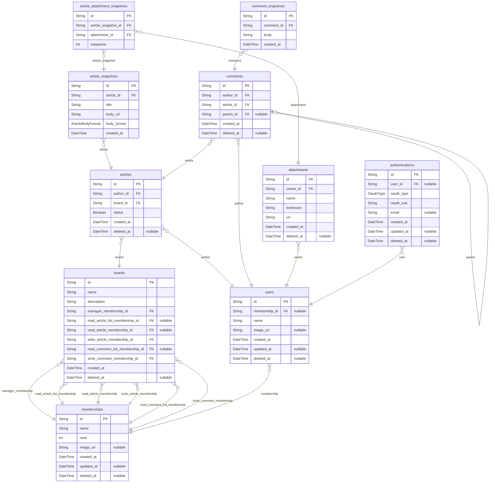
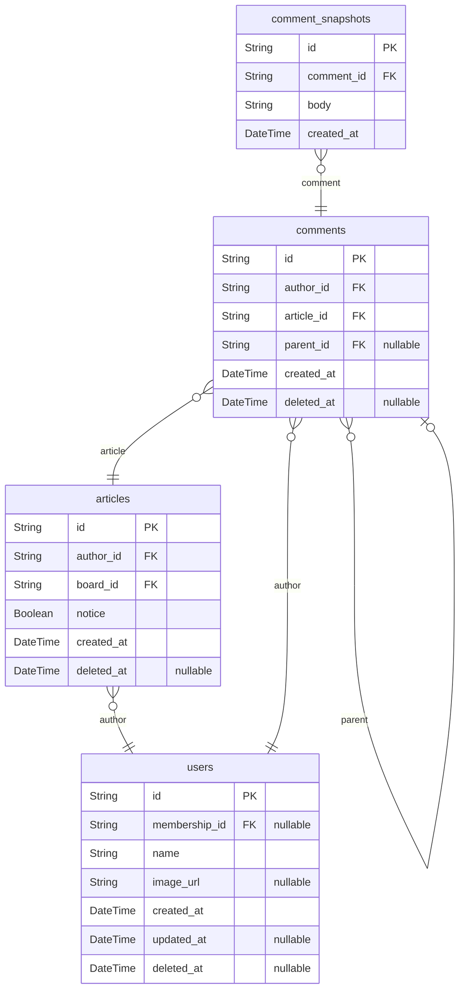
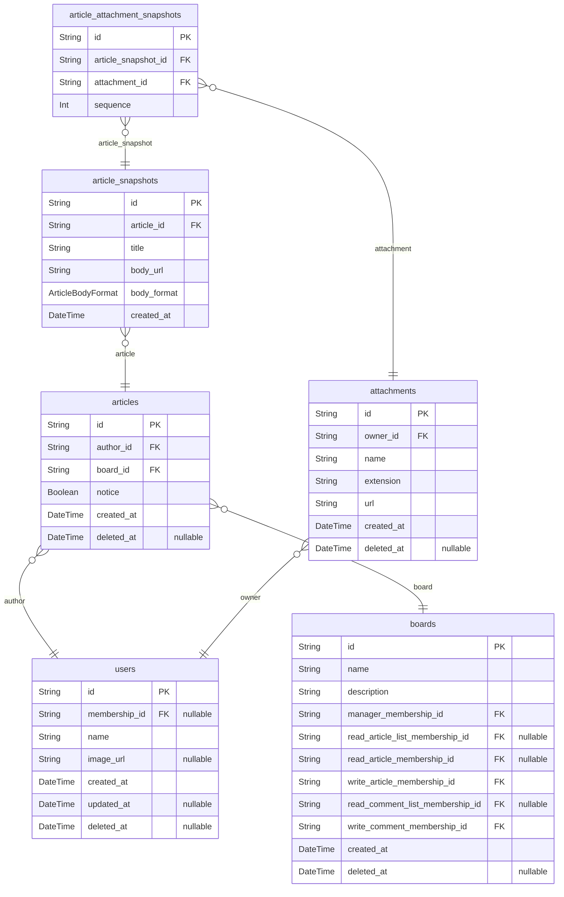
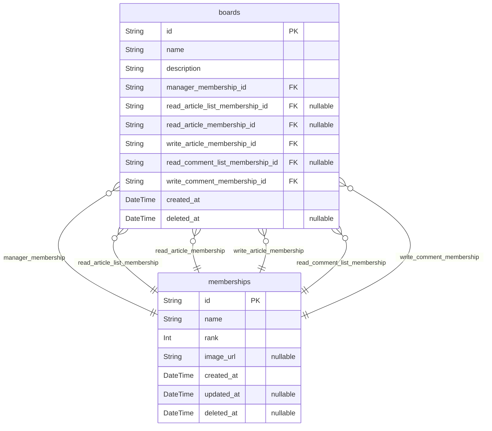
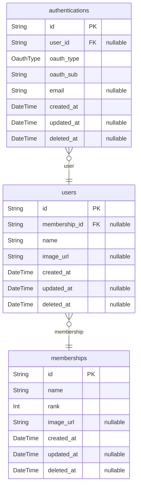

# BBS

> Generated by [`prisma-markdown`](https://github.com/samchon/prisma-markdown)

-   [All](#All)
-   [Comment](#Comment)
-   [Article](#Article)
-   [Board](#Board)
-   [User](#User)

## All

### `articles`

Root Entity of Article

**Properties**

-   `id`: `uuid` string
-   `author_id`
    > referenced in `users`
    >
    > `uuid` string
-   `board_id`
    > referenced in `boards`
    >
    > `uuid` string
-   `notice`: Indicate whether a article is notification.
-   `created_at`: creation time of record
-   `deleted_at`: deletion time of record

### `article_snapshots`

Snapshot of Article

an `article_snapshots` record contains the content of an article's specific version.

When a user edit an article, a new snapshot record is created, and readers will view the snapshot record linked to the most recently created version among the connected records.

**Properties**

-   `id`: `uuid` string
-   `article_id`
    > referenced in `articles`
    >
    > `uuid` string
-   `title`: title of article
-   `body_url`: URL path of article body resource
-   `body_format`: one of `html`, `md`, `txt`
-   `created_at`: creation time of record

### `article_attachment_snapshots`

Attachment Snapshot for Article

an `article_attachment_snapshots` entity connects an `article_snapshots` record with an `attachments` record.

If author add attachment to an article, a new record of `article_attachment_snapshots` is created.

**Properties**

-   `id`: `uuid` string
-   `article_snapshot_id`
    > referenced in `article_snapshots`
    >
    > `uuid` string
-   `attachment_id`
    > referenced in `attachments`
    >
    > `uuid` string
-   `sequence`:

### `boards`

Root Entity of Board

**Properties**

-   `id`: `uuid` string
-   `name`:
-   `description`:
-   `manager_membership_id`
    > referenced in `memberships`
    >
    > `uuid` string
-   `read_article_list_membership_id`
    > referenced in `memberships`
    >
    > `uuid` string
-   `read_article_membership_id`
    > referenced in `memberships`
    >
    > `uuid` string
-   `write_article_membership_id`
    > referenced in `memberships`
    >
    > `uuid` string
-   `read_comment_list_membership_id`
    > referenced in `memberships`
    >
    > `uuid` string
-   `write_comment_membership_id`
    > referenced in `memberships`
    >
    > `uuid` string
-   `created_at`: creation time of record
-   `deleted_at`: deletion time of record

### `comments`

Root Entity of Comment

a user can comment short text on article or other comment

**Properties**

-   `id`: `uuid` string
-   `author_id`
    > referenced in `users`
    >
    > `uuid` string
-   `article_id`
    > referenced in `articles`
    >
    > `uuid` string
-   `parent_id`
    > a parent comment id in a hierarchical structure
    >
    > referenced in `comments`
    >
    > `uuid` string
-   `created_at`: creation time of record
-   `deleted_at`: deletion time of record

### `comment_snapshots`

Snapshot of Comment

an `comment_snapshots` record contains the content of an comment's specific version.

When a user edit an comment, a new snapshot record is created, and readers will view the snapshot record linked to the most recently created version among the connected records.

**Properties**

-   `id`: `uuid` string
-   `comment_id`
    > referenced in `comments`
    >
    > `uuid` string
-   `body`:
-   `created_at`: creation time of record

### `attachments`

Attachment Entity

All the attachment resources managed in the BBS

**Properties**

-   `id`: `uuid` string
-   `owner_id`
    > `attachment` file can only be attached by the owner
    >
    > referenced in `users`
    >
    > `uuid` string
-   `name`: name of attachment resource
-   `extension`: extension of resource like `md`, `html`, `jpeg`...
-   `url`: URL path of real resource
-   `created_at`: creation time of record
-   `deleted_at`: deletion time of record

### `memberships`

Membership Entity

a user can receive one or zero membership, which signifies their permission level in the BBS.

**Properties**

-   `id`: `uuid` string
-   `name`: displated name of membership
-   `rank`: `rank` is used for membership grade comparison
-   `image_url`:
-   `created_at`: creation time of record
-   `updated_at`: revision time of record
-   `deleted_at`: deletion time of record

### `authentications`

Authentication Entity of User

combination of `oauth_sub` and `oauth_type` is unique.

**Properties**

-   `id`: `uuid` string
-   `user_id`
    > referenced in `users`
    >
    > `uuid` string
-   `oauth_type`: one of `github`, `kakao`,
-   `oauth_sub`: oauth server user id
-   `email`: verified email
-   `created_at`: creation time of record
-   `updated_at`: revision time of record
-   `deleted_at`: deletion time of record

### `users`

Root Entity of User

**Properties**

-   `id`: `uuid` string
-   `membership_id`
    > Indicate user permission level
    >
    > referenced in `memberships`
    >
    > `uuid` string
-   `name`: displayed name of user
-   `image_url`: url of user profile image
-   `created_at`: creation time of record
-   `updated_at`: revision time of record
-   `deleted_at`: deletion time of record

## Comment

### `articles`

Root Entity of Article

**Properties**

-   `id`: `uuid` string
-   `author_id`
    > referenced in `users`
    >
    > `uuid` string
-   `board_id`
    > referenced in `boards`
    >
    > `uuid` string
-   `notice`: Indicate whether a article is notification.
-   `created_at`: creation time of record
-   `deleted_at`: deletion time of record

### `comments`

Root Entity of Comment

a user can comment short text on article or other comment

**Properties**

-   `id`: `uuid` string
-   `author_id`
    > referenced in `users`
    >
    > `uuid` string
-   `article_id`
    > referenced in `articles`
    >
    > `uuid` string
-   `parent_id`
    > a parent comment id in a hierarchical structure
    >
    > referenced in `comments`
    >
    > `uuid` string
-   `created_at`: creation time of record
-   `deleted_at`: deletion time of record

### `comment_snapshots`

Snapshot of Comment

an `comment_snapshots` record contains the content of an comment's specific version.

When a user edit an comment, a new snapshot record is created, and readers will view the snapshot record linked to the most recently created version among the connected records.

**Properties**

-   `id`: `uuid` string
-   `comment_id`
    > referenced in `comments`
    >
    > `uuid` string
-   `body`:
-   `created_at`: creation time of record

### `users`

Root Entity of User

**Properties**

-   `id`: `uuid` string
-   `membership_id`
    > Indicate user permission level
    >
    > referenced in `memberships`
    >
    > `uuid` string
-   `name`: displayed name of user
-   `image_url`: url of user profile image
-   `created_at`: creation time of record
-   `updated_at`: revision time of record
-   `deleted_at`: deletion time of record

## Article

### `articles`

Root Entity of Article

**Properties**

-   `id`: `uuid` string
-   `author_id`
    > referenced in `users`
    >
    > `uuid` string
-   `board_id`
    > referenced in `boards`
    >
    > `uuid` string
-   `notice`: Indicate whether a article is notification.
-   `created_at`: creation time of record
-   `deleted_at`: deletion time of record

### `article_snapshots`

Snapshot of Article

an `article_snapshots` record contains the content of an article's specific version.

When a user edit an article, a new snapshot record is created, and readers will view the snapshot record linked to the most recently created version among the connected records.

**Properties**

-   `id`: `uuid` string
-   `article_id`
    > referenced in `articles`
    >
    > `uuid` string
-   `title`: title of article
-   `body_url`: URL path of article body resource
-   `body_format`: one of `html`, `md`, `txt`
-   `created_at`: creation time of record

### `article_attachment_snapshots`

Attachment Snapshot for Article

an `article_attachment_snapshots` entity connects an `article_snapshots` record with an `attachments` record.

If author add attachment to an article, a new record of `article_attachment_snapshots` is created.

**Properties**

-   `id`: `uuid` string
-   `article_snapshot_id`
    > referenced in `article_snapshots`
    >
    > `uuid` string
-   `attachment_id`
    > referenced in `attachments`
    >
    > `uuid` string
-   `sequence`:

### `boards`

Root Entity of Board

**Properties**

-   `id`: `uuid` string
-   `name`:
-   `description`:
-   `manager_membership_id`
    > referenced in `memberships`
    >
    > `uuid` string
-   `read_article_list_membership_id`
    > referenced in `memberships`
    >
    > `uuid` string
-   `read_article_membership_id`
    > referenced in `memberships`
    >
    > `uuid` string
-   `write_article_membership_id`
    > referenced in `memberships`
    >
    > `uuid` string
-   `read_comment_list_membership_id`
    > referenced in `memberships`
    >
    > `uuid` string
-   `write_comment_membership_id`
    > referenced in `memberships`
    >
    > `uuid` string
-   `created_at`: creation time of record
-   `deleted_at`: deletion time of record

### `attachments`

Attachment Entity

All the attachment resources managed in the BBS

**Properties**

-   `id`: `uuid` string
-   `owner_id`
    > `attachment` file can only be attached by the owner
    >
    > referenced in `users`
    >
    > `uuid` string
-   `name`: name of attachment resource
-   `extension`: extension of resource like `md`, `html`, `jpeg`...
-   `url`: URL path of real resource
-   `created_at`: creation time of record
-   `deleted_at`: deletion time of record

### `users`

Root Entity of User

**Properties**

-   `id`: `uuid` string
-   `membership_id`
    > Indicate user permission level
    >
    > referenced in `memberships`
    >
    > `uuid` string
-   `name`: displayed name of user
-   `image_url`: url of user profile image
-   `created_at`: creation time of record
-   `updated_at`: revision time of record
-   `deleted_at`: deletion time of record

## Board

### `boards`

Root Entity of Board

**Properties**

-   `id`: `uuid` string
-   `name`:
-   `description`:
-   `manager_membership_id`
    > referenced in `memberships`
    >
    > `uuid` string
-   `read_article_list_membership_id`
    > referenced in `memberships`
    >
    > `uuid` string
-   `read_article_membership_id`
    > referenced in `memberships`
    >
    > `uuid` string
-   `write_article_membership_id`
    > referenced in `memberships`
    >
    > `uuid` string
-   `read_comment_list_membership_id`
    > referenced in `memberships`
    >
    > `uuid` string
-   `write_comment_membership_id`
    > referenced in `memberships`
    >
    > `uuid` string
-   `created_at`: creation time of record
-   `deleted_at`: deletion time of record

### `memberships`

Membership Entity

a user can receive one or zero membership, which signifies their permission level in the BBS.

**Properties**

-   `id`: `uuid` string
-   `name`: displated name of membership
-   `rank`: `rank` is used for membership grade comparison
-   `image_url`:
-   `created_at`: creation time of record
-   `updated_at`: revision time of record
-   `deleted_at`: deletion time of record

## User

### `memberships`

Membership Entity

a user can receive one or zero membership, which signifies their permission level in the BBS.

**Properties**

-   `id`: `uuid` string
-   `name`: displated name of membership
-   `rank`: `rank` is used for membership grade comparison
-   `image_url`:
-   `created_at`: creation time of record
-   `updated_at`: revision time of record
-   `deleted_at`: deletion time of record

### `authentications`

Authentication Entity of User

combination of `oauth_sub` and `oauth_type` is unique.

**Properties**

-   `id`: `uuid` string
-   `user_id`
    > referenced in `users`
    >
    > `uuid` string
-   `oauth_type`: one of `github`, `kakao`,
-   `oauth_sub`: oauth server user id
-   `email`: verified email
-   `created_at`: creation time of record
-   `updated_at`: revision time of record
-   `deleted_at`: deletion time of record

### `users`

Root Entity of User

**Properties**

-   `id`: `uuid` string
-   `membership_id`
    > Indicate user permission level
    >
    > referenced in `memberships`
    >
    > `uuid` string
-   `name`: displayed name of user
-   `image_url`: url of user profile image
-   `created_at`: creation time of record
-   `updated_at`: revision time of record
-   `deleted_at`: deletion time of record
