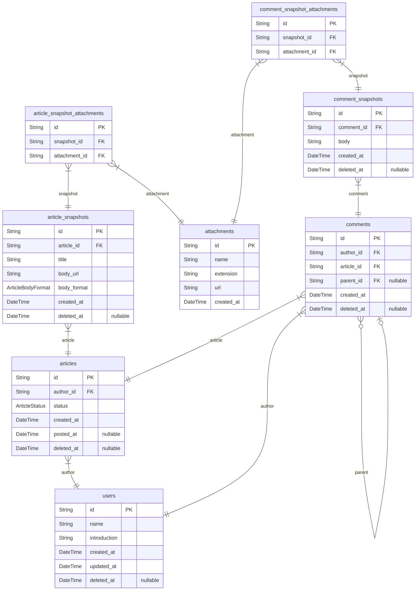
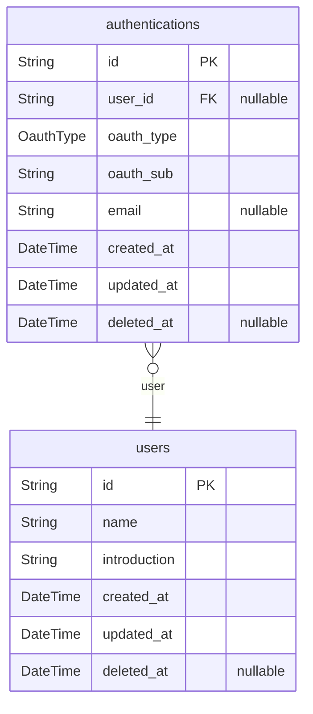

# BBS

> Generated by [`prisma-markdown`](https://github.com/samchon/prisma-markdown)

-   [BBS](#BBS)
-   [User](#User)

## BBS

### `articles`

Root Entity of Article

**Properties**

-   `id`
    > record identity
    >
    > `uuid` type
-   `author_id`
    > referenced in `users`
    >
    > `uuid` type
-   `status`: one of `pending`, `active`, `deleted`
-   `created_at`: creation time of record
-   `posted_at`: posting time of article
-   `deleted_at`
    > deletion time of record
    >
    > if null, a record is soft-deleted

### `article_snapshots`

Snapshot of Article

an `article_snapshots` record contains the content of an article's specific version.

When a user edit an article, a new snapshot record is created, and readers will view the snapshot record linked to the most recently created version among the connected records.

**Properties**

-   `id`
    > record identity
    >
    > `uuid` type
-   `article_id`
    > referenced in `articles`
    >
    > `uuid` type
-   `title`: title of article
-   `body_url`: URL path of article body resource
-   `body_format`: one of `html`, `md`, `txt`
-   `created_at`: creation time of record
-   `deleted_at`
    > deletion time of record
    >
    > if null, a record is soft-deleted

### `article_snapshot_attachments`

Relation Attachment with Article Snapshot

an `article_snapshot_attachments` entity connects an `article_snapshots` record with an `attachments` record.

If author add attachment to an article, a new record of `article_snapshot_attachments` is created.

**Properties**

-   `id`
    > record identity
    >
    > `uuid` type
-   `snapshot_id`
    > referenced in `article_snapshots`
    >
    > `uuid` type
-   `attachment_id`
    > referenced in `attachments`
    >
    > `uuid` type

### `attachments`

Attachment Entity

All the attachment resources managed in the BBS

**Properties**

-   `id`
    > record identity
    >
    > `uuid` type
-   `name`: name of attachment resource
-   `extension`: extension of resource like `md`, `html`, `jpeg`...
-   `url`: URL path of real resource
-   `created_at`: creation time of record

### `comments`

Root Entity of Comment

**Properties**

-   `id`
    > record identity
    >
    > `uuid` type
-   `author_id`
    > referenced in `users`
    >
    > `uuid` type
-   `article_id`
    > referenced in `articles`
    >
    > `uuid` type
-   `parent_id`
    > referenced in `comments`
    >
    > `uuid` type
    >
    > a parent comment id in a hierarchical structure
-   `created_at`: creation time of record
-   `deleted_at`
    > deletion time of record
    >
    > if null, a record is soft-deleted

### `comment_snapshots`

Snapshot of Comment

**Properties**

-   `id`
    > record identity
    >
    > `uuid` type
-   `comment_id`
    > referenced in `comments`
    >
    > `uuid` type
-   `body`:
-   `created_at`: creation time of record
-   `deleted_at`
    > deletion time of record
    >
    > if null, a record is soft-deleted

### `comment_snapshot_attachments`

Relation Attachment with Comment Snapshot

an `comment_snapshot_attachments` entity connects an `comment_snapshots` record with an `attachments` record.

If author add attachment to an comment, a new record of `comment_snapshot_attachments` is created.

**Properties**

-   `id`
    > record identity
    >
    > `uuid` type
-   `snapshot_id`
    > referenced in `comment_snapshots`
    >
    > `uuid` type
-   `attachment_id`
    > referenced in `attachments`
    >
    > `uuid` type

### `users`

Root Entity of User Profile

**Properties**

-   `id`
    > record identity
    >
    > `uuid` type
-   `name`: displayed name of user
-   `introduction`: user introduction
-   `created_at`: creation time of record
-   `updated_at`: revision time of record
-   `deleted_at`
    > deletion time of record
    >
    > if null, a record is soft-deleted

## User

### `authentications`

Authentication Entity of User

**Properties**

-   `id`
    > record identity
    >
    > `uuid` type
-   `user_id`
    > referenced in `users`
    >
    > `uuid` type
-   `oauth_type`: one of `github`, `kakao`
-   `oauth_sub`: oauth server user id
-   `email`: verified email
-   `created_at`: creation time of record
-   `updated_at`: revision time of record
-   `deleted_at`
    > deletion time of record
    >
    > if null, a record is soft-deleted

### `users`

Root Entity of User Profile

**Properties**

-   `id`
    > record identity
    >
    > `uuid` type
-   `name`: displayed name of user
-   `introduction`: user introduction
-   `created_at`: creation time of record
-   `updated_at`: revision time of record
-   `deleted_at`
    > deletion time of record
    >
    > if null, a record is soft-deleted
